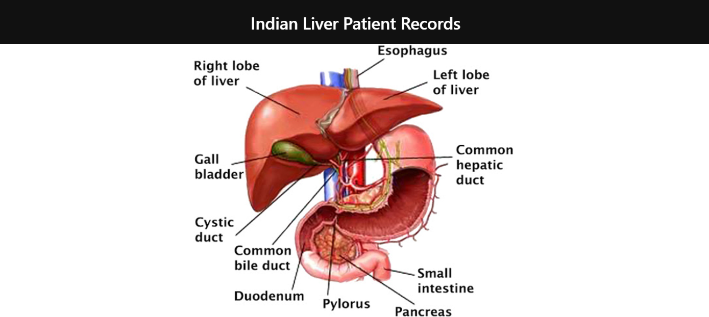

  
 

<i>
<h2><i>Description </i></h2>

 Patients with Liver disease have been continuously increasing because of excessive consumption of alcohol, inhale of harmful gases, intake of contaminated food, pickles and drugs. This dataset was used to evaluate prediction algorithms in an effort to reduce burden on doctors.

 
 
 

  <h2> Content </h2>

 This data set contains 416 liver patient records and 167 non liver patient records collected from North East of Andhra Pradesh, India. The "Dataset" column is a class label used to divide groups into liver patient (liver disease) or not (no disease). This data set contains 441 male patient records and 142 female patient records.
     
  
   <h2>Problem Statemtent </h2>

By using these patient records to determine which patients have liver disease and which ones do not.
     

  
<h2>Business objectives and constraints </h2>
<h3>1. The cost of a mis-classification can be high. </h3>
<h3>2. There is strict latency concerns. </h3>

     
  

<h2>Concluion
  
  
 

### Give It a Star if you liked the project 
